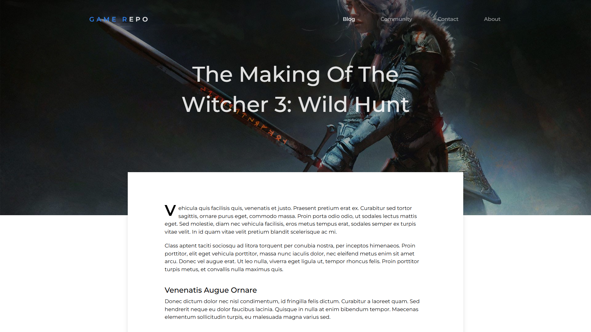
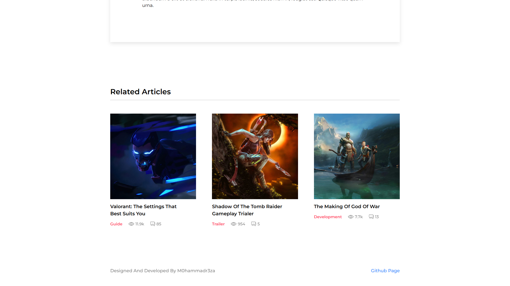
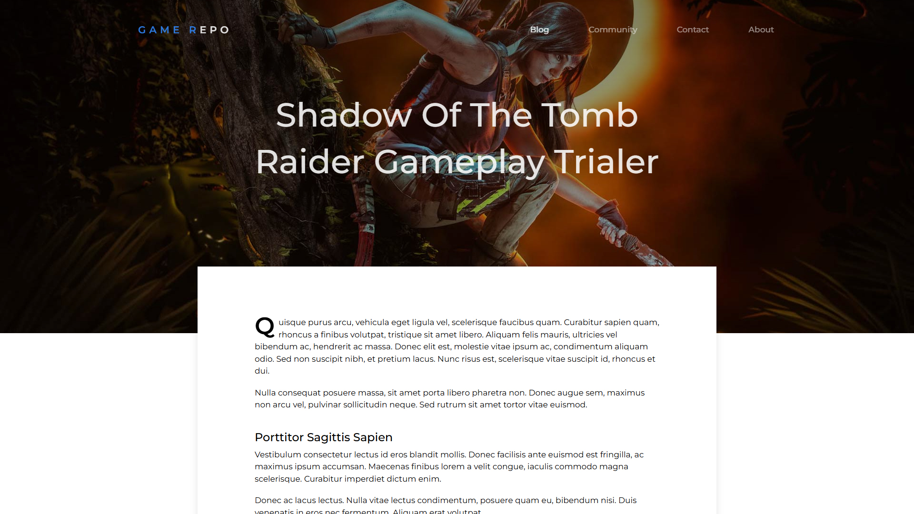

# Blog Articles Web Application

[Live Demo](https://blog-web-application-4lgr.onrender.com) • A project about article pages in a blog websites that I designed and developed. My main goal working on this project was to focus on mobile first implementation, write clean and maintainable css by following BEM convention as well as best practices in styling, and work on fundamental animation techniques in css.

## Features

- Single-page application (SPA) architecture
- Responsive mobile-first design
- BEM convention for clean, maintainable styling
- Responsive, zero-dependency, animated navbar on mobile
- SEO-optimized by using semantic HTML
- Client-side routing with React Router
- RESTful API backend
- MongoDB database integration

## Technologies

**Frontend:**

- React
- React Router
- Sass

**Backend:**

- Express.js
- Mongoose (MongoDB ODM)
- CORS

**Database:**

- MongoDB

**DevOps:**

- GitHub Actions (CI/CD)

## Installation

1. Clone repository
2. Run `npm run install-all` (installs both server & client dependencies)
3. Create `.env` file with MongoDB URI:
   ```
   MONGO_URI=your_mongodb_connection_string
   ```
4. Populate database: `npm run populate-database`
5. Start development servers: `npm run dev`

## Running

- Development: `npm run dev` (runs both server and client concurrently)
- Production build: `npm run build` then `npm start`

Access via:

- Backend: http://localhost:5000
- Frontend: http://localhost:3000

## Screenshots






